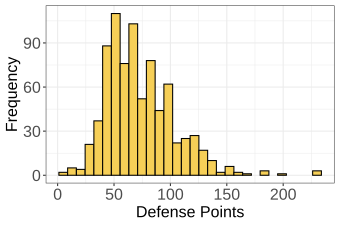

<label>
<input type="checkbox" class="include-item" data-item-id="item_6">
Include in export
</label>

The following histogram depicts the distribution of defence points for all of the Pokemon characters (up to generation VII) in the popular video game franchise Pokémon. According to the esteemed Pokémon Database, defence points, "measure the ability to take attacks from other Pokémon; the higher the stat is, the fewer Hit Points will be lost when attacked."

Using inequalities (i.e., greater and less than symbols > <), choose the option that best describes this distribution:

*  Mean < Median > Mode
*  Median > Mode > Mean
*  Mode > Median > Mean
*  Mean > Median > Mode
*  Median > Mean > Mode

### Correct Answer
FALSE, FALSE, FALSE, TRUE, FALSE

### Solution:
Extreme values on the right side will pull the **mean** towards the right the most, followed by the **median**, and then the **mode**.

Values on the right side of the x-axis have a larger numerical value than values on the left.

In a right-skewed distribution like this one, the mean is pulled most strongly by extreme values, making it the largest measure of central tendency, followed by the median, then the mode.

Thus, the answer is: **Mean > Median > Mode**

 

---

<a href="item_5.html">← Previous (item_5)</a><a href="item_7.html">Next (item_7) →</a>

